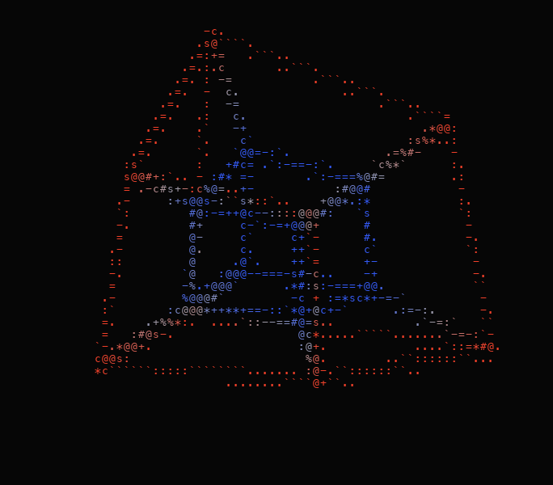
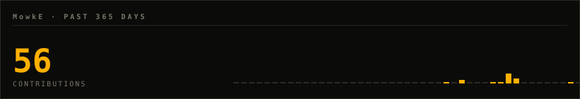
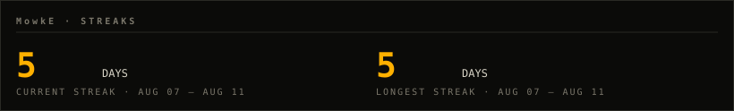
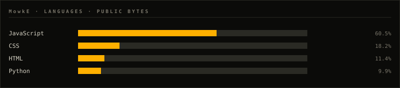
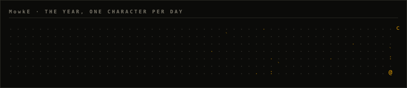

 

<samp>my brain is shifting</samp>

  

<samp>I make invisible dimensions visible — in the browser, from scratch, zero dependencies.</samp>

 

<table align="center">
  <tr>
    <td align="center" width="33%">
       
      <a href="https://mowke.github.io/HYPERSHAPE/"><samp><b>HYPERSHAPE</b></samp></a> 
      <samp>rotate real 4D shapes · color is the 4th axis</samp>
    </td>
    <td align="center" width="33%">
       
      <a href="https://mowke.github.io/LUMA/"><samp><b>LUMA</b></samp></a> 
      <samp>six experiments on color &amp; the eye</samp>
    </td>
    <td align="center" width="33%">
       
      <a href="https://mowke.github.io/LUMASHAPE/"><samp><b>LUMASHAPE</b></samp></a> 
      <samp>a bird's 4D color space · UV is the axis you're missing</samp>
    </td>
  </tr>
</table>

 

  

<samp>this page draws itself — the portrait and every card are generated
 by <a href="https://github.com/MowkE/MowkE">this repository</a>, nightly, with zero third-party requests</samp>

